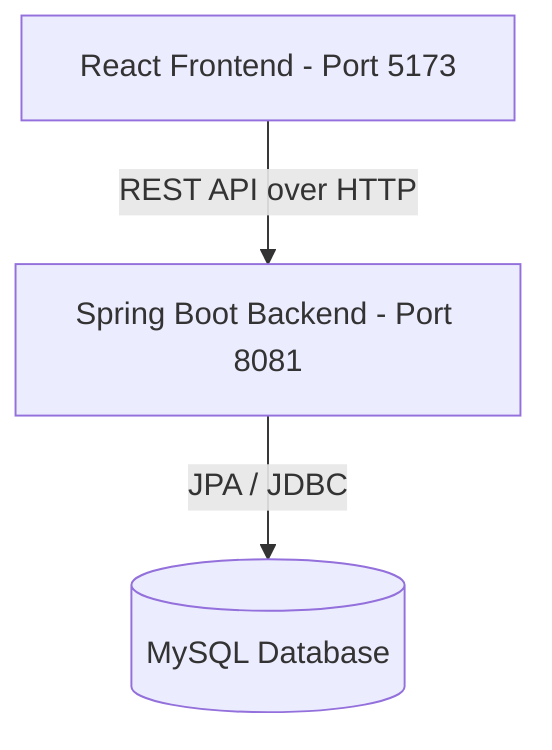

# Hotel Reservation Premium - Architecture Document

This document outlines the architecture and components of the **Hotel Reservation Premium** application.

---

## 1. System Overview

The system follows a decoupled Client-Server architecture:
- **Backend**: Spring Boot 3.5.7 application serving a REST API on port `8081` with context path `/hotel_reservation_premium`.
- **Frontend**: React SPA built with Vite on port `5173`.

---

## 2. Frontend Architecture (React)

Located in `frontend-react/`. It is structured as a component-driven Single Page Application (SPA).

### Directory Structure

- `src/api/`: Axios client configuration (`axiosClient.js`) and API services (e.g., `reservationApi.js`, `roomApi.js`, `authApi.js`).
- `src/components/`: Shared layout and structural components:
  - `layout/Layout.jsx`: Main administrative page wrapper.
  - `layout/Sidebar.jsx`: Dynamic administrative navigation.
- `src/context/`: React Context providers for global states:
  - `AuthContext.jsx`: Authentication status, user information, login/logout actions.
  - `ToastContext.jsx`: Global Toast Notification System replacing browser `alert()`.
- `src/features/`: Component groups organized by business feature areas:
  - `auth/`: Login and authorization components.
  - `dashboard/`: `Admin.jsx` (administrative reporting), `Dashboard.jsx` (room occupancy/sales graphs), and `UserHome.jsx` (the customer-facing booking panel).
  - `rooms/`: Room inventory and room type configuration.
  - `reservations/`: Booking registration panels (`Reservations.jsx`) and detailed transaction states (`BookingDetail.jsx`).
- `src/shared/`: Constants and utility helpers shared across components.

---

## 3. Backend Architecture (Spring Boot)

The Java backend is structured into domain packages under `com.hotelreservation.module`:

### Core Layering
- **Entities**: JPA Hibernate classes mapping directly to MySQL tables (e.g., `User.java`, `Emp.java`, `Guest.java`, `Reservation.java`, `ReservationRoom.java`).
- **Repositories**: Standard JPA Data interfaces containing custom `@Query` definitions.
- **Services**: Domain business layer interfaces and implementation classes (e.g., `ReservationServiceImpl.java`).
- **Controllers**: Spring MVC `@RestController` classes exposing JSON endpoints.

---

## 4. Key Security & Logic Design

1. **Role-Based Access Control**:
   - `MANAGER`: Full CRUD access to user accounts, roles, hotel services, room inventory.
   - `EMPLOYEE`: Access to checking in/out guests, viewing occupancy reports, registering room services.
   - `CUSTOMER`: Access restricted to viewing room availability, reserving rooms, and canceling/viewing their own bookings.
2. **Explicit User-Guest Relationship**:
   - Logged-in customers are explicitly linked to a single `Guest` record via the `guestId` foreign key on the `User` entity, avoiding unsafe search guessing.
3. **Reservation Status Rules**:
   - Reservation entity statuses: `PENDING_PAYMENT`, `CONFIRMED`, `CANCELLED`, `PENDING_EXPIRED`.
   - Check-in and Check-out statuses are kept locally on the `ReservationRoom` level.
