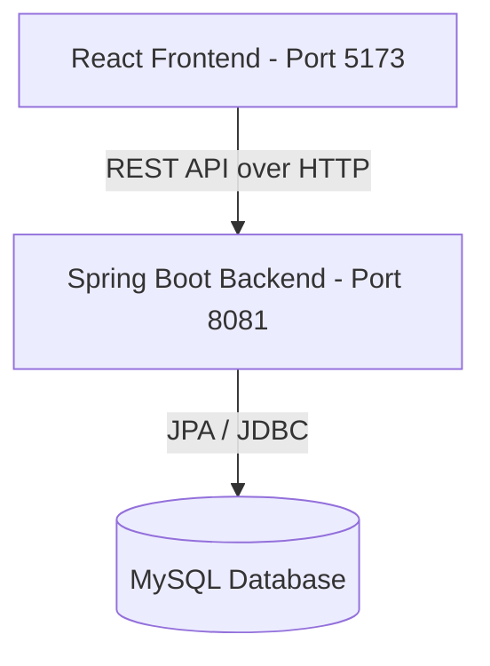

# Hotel Reservation Premium - Architecture Document

This document outlines the architecture and components of the **Hotel Reservation Premium** application.

---

## 1. System Overview

The system follows a decoupled Client-Server architecture:
- **Backend**: Spring Boot 3.5.7 application serving a REST API on port `8081` with context path `/hotel_reservation_premium`.
- **Frontend**: React SPA built with Vite on port `5173`.

---

## 2. Frontend Architecture (React)

Located in `frontend/`. It is structured as a component-driven Single Page Application (SPA).

### Directory Structure

- `src/services/`: Axios client configuration (`axiosClient.ts`) and API services (e.g., `reservationApi.ts`, `roomApi.ts`, `authApi.ts`).
- `src/components/`: Shared UI components (`ui/`) and feature-specific components (`bookings/`).
- `src/layouts/`: Page layout wrappers (`Layout.tsx`, `Sidebar.tsx`, `Header.tsx`, `CustomerLayout.tsx`).
- `src/contexts/`: React Context providers for global states:
  - `AuthContext.tsx`: Authentication status, user information, login/logout actions.
  - `ToastContext.tsx`: Global Toast Notification System replacing browser `alert()`.
  - `ConfirmContext.tsx`: Confirmation dialog system.
- `src/pages/`: Page components organized by feature area:
  - `auth/`: Login, Register, and ForgotPassword pages.
  - `dashboard/`: Dashboard and Admin reporting pages.
  - `bookings/`: Reservation management (Reservations, BookingDetail, Bills, ReservationGuests).
  - `rooms/`: Room inventory management.
  - `services/`: Hotel amenity/service management.
  - `guests/`: Guest management.
  - `employees/`: Employee management.
  - `customer/`: Customer-facing booking panel (UserHome).
- `src/hooks/`: Custom React hooks (useAuth, useBookings, useFetch, etc.).
- `src/constants/`: Shared constants (role definitions, status mappings).
- `src/utils/`: Utility helpers (date formatting, number formatting).

---

## 3. Backend Architecture (Spring Boot)

The Java backend is structured into domain packages directly under `com.hotelreservation`:

### Package Structure
- `account/` — User, Employee, Guest, and Role management
- `billing/` — Bill generation and payment tracking
- `hotelservice/` — Hotel amenities and used-service tracking
- `reservation/` — Reservation lifecycle (booking, check-in/out, status)
- `room/` — Room and RoomType inventory
- `report/` — Revenue and usage reporting
- `common/` — Shared enums, exceptions, base entity, and API response wrappers
- `config/` — Spring configuration (CORS, Security, Swagger, data seeders)
- `security/` — JWT authentication, rate limiting, and access control
- `scheduler/` — Scheduled jobs (auto-checkout, pending expiration)

### Core Layering (within each domain package)
- **Entities**: JPA Hibernate classes mapping directly to MySQL tables (e.g., `User.java`, `Emp.java`, `Guest.java`, `Reservation.java`, `ReservationRoom.java`).
- **Repositories**: Standard JPA Data interfaces containing custom `@Query` definitions.
- **Services**: Domain business layer interfaces and implementation classes (e.g., `ReservationServiceImpl.java`).
- **Controllers**: Spring MVC `@RestController` classes exposing JSON endpoints.
- **DTOs**: Request/Response data transfer objects.
- **Mappers**: Entity-to-DTO conversion utilities.

---

## 4. Key Security & Logic Design

1. **Role-Based Access Control**:
   - `MANAGER`: Full CRUD access to user accounts, roles, hotel services, room inventory.
   - `EMPLOYEE`: Access to checking in/out guests, viewing occupancy reports, registering room services.
   - `CUSTOMER`: Access restricted to viewing room availability, reserving rooms, and canceling/viewing their own bookings.
2. **Explicit User-Guest Relationship**:
   - Logged-in customers are explicitly linked to a single `Guest` record via the `guestId` foreign key on the `User` entity, avoiding unsafe search guessing.
3. **Reservation Status Rules**:
   - Reservation entity statuses: `PENDING_PAYMENT`, `CONFIRMED`, `CANCELLED`, `PENDING_EXPIRED`.
   - Check-in and Check-out statuses are kept locally on the `ReservationRoom` level.
